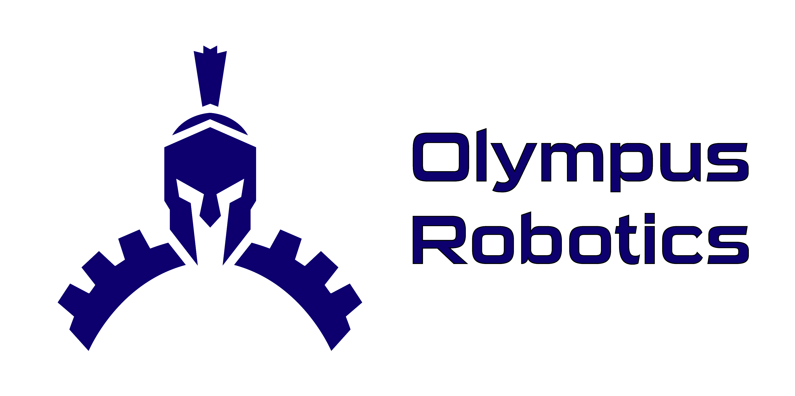

# Olympus Robotics 4982

## Purpose
Github repo for code and documentation for FRC team 4982.

## Folders

 Each folder contains the WPILib code for that particular year. The folder is named after whatever we decided to call the robot that year. There is a `gradlew` file that allows you to upload to the RoboRio and will theoretically automatically handle dependancies. This file does not exist on robots developed using python and robotpy.
 Any code before 2024 has an outdated gradle and has not been pulled to the newest version of wpilib.
 
 Kinkmaster69 - oldest 
 
 Marvin - 2022 season
 
 Bob - 2023 season
 
 Perry - 2024 season

 Riptide - 2025 season

 Manual Test (Lebot) - 2026 season
