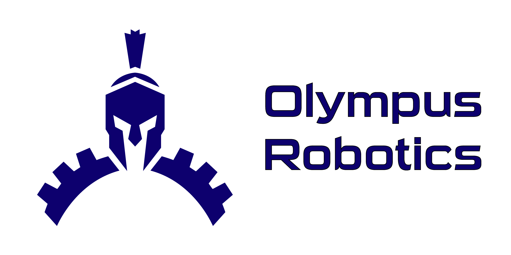

# Olympus Robotics 4982

## Purpose

GitHub repo for code and documentation for FRC Team 4982 — Olympus Robotics.

## Current Season — Theseus (2026)

**Theseus** is the active robot for the 2026 season, written in Java with GradleRIO 2026.2.1.

- **Architecture**: WPILib Command-Based (`TimedCommandRobot`, subsystems, commands)
- **Drive**: Swerve (CTRE TalonFX drive + REV Spark Max rotation + absolute encoders)
- **Gyro**: CTRE Pigeon2
- **Vision**: PhotonVision
- **Autonomous**: PathPlanner
- **Build**: `./gradlew build` · **Deploy**: `./gradlew deploy`

## Robots

Each folder contains the WPILib code for that season's robot. Code before 2024 uses an outdated Gradle version and has not been updated.

| Robot | Season | Language | Status |
|-------|--------|----------|--------|
| [Theseus](https://github.com/OlympusRobotics/Olympus_Robotics_FRC/tree/main/Theseus)             | 2026 | Java   | **Active** |
| [Riptide](https://github.com/OlympusRobotics/Olympus_Robotics_FRC/tree/main/Riptide)             | 2025 | Python | Legacy |
| [Perry](https://github.com/OlympusRobotics/Olympus_Robotics_FRC/tree/main/perry)                 | 2024 | Python | Legacy |
| [BobTheCheezIt](https://github.com/OlympusRobotics/Olympus_Robotics_FRC/tree/main/BobTheCheezIt) | 2023 | C++    | Legacy |
| [Marvin](https://github.com/OlympusRobotics/Olympus_Robotics_FRC/tree/main/marvin)               | 2022 | C++    | Legacy |
| [2020 Robot, Ted](https://github.com/OlympusRobotics/Olympus_Robotics_FRC/tree/main/jankmaster62)  |≈2020 | C++    | Legacy |