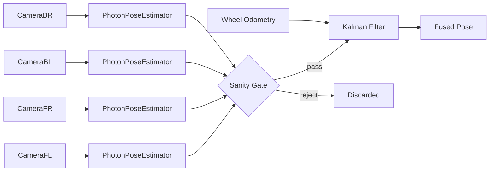

# Vision Pose Estimation — Design Notes

## Approach: Multi-Tag PNP on Coprocessor + Feed All Cameras

Each camera uses a `PhotonPoseEstimator` configured with **`MULTI_TAG_PNP_ON_COPROCESSOR`** and a single-tag **`LOWEST_AMBIGUITY`** fallback. The coprocessor solves multi-tag PNP natively (no roboRIO CPU cost), and when only one tag is visible, it falls back to the lowest-ambiguity single-tag estimate.

Every camera measurement that passes sanity checks is fed into the drivetrain's Kalman filter with continuously scaled standard deviations based on tag count and ambiguity.

### Data Flow

### Pose Strategy

| Strategy | When Used | Benefit |
|----------|-----------|---------|
| `MULTI_TAG_PNP_ON_COPROCESSOR` | 2+ tags visible | Eliminates 180° ambiguity, sub-cm accuracy, solved on coprocessor |
| `LOWEST_AMBIGUITY` (fallback) | 1 tag visible | Best available single-tag estimate |

Multi-tag PNP uses all visible AprilTags simultaneously to solve the camera's field position. This eliminates the classic single-tag 180° flip ambiguity and provides significantly better accuracy. The solve runs on the PhotonVision coprocessor, so it adds zero load to the roboRIO.

### Sanity Gate (reject before filtering)

| Check | Threshold | Why |
|-------|-----------|-----|
| Ambiguity (single-tag only) | > 0.25 | Detection is too uncertain to be useful |
| Field bounds | x ∉ [0, 16.54] or y ∉ [0, 8.21] | Physically impossible pose |
| Pose jump | > 5 m from current odometry | Likely a misidentified tag |

Multi-tag estimates skip the ambiguity check since PNP with 2+ tags is inherently unambiguous.

### Standard Deviation Scaling

| Condition | XY Std Dev | Theta Std Dev | Rationale |
|-----------|-----------|---------------|-----------|
| Multi-tag (2+ tags) | 0.01 m | 2° | Very high confidence — PNP eliminates ambiguity |
| Single-tag | 0.02 + ambiguity × 2.0 | 5° + ambiguity × 50° | Scaled by detection quality |

### Pose Seeding

On startup, the first 5 good vision readings hard-reset the drivetrain pose via `resetPose()`. This ensures the gyro heading is initialized from vision (since the Pigeon2 is not zeroed at boot). After seeding completes, all measurements go through `addVisionMeasurement()` for Kalman filter fusion.

## Timestamp Handling

We use `estimate.timestampSeconds` from PhotonPoseEstimator (the actual image capture time) instead of `Timer.getFPGATimestamp()`. The difference matters because:

- Image capture → processing → NetworkTables transfer adds 20–80 ms of latency
- The Kalman filter uses the timestamp to retroactively insert the measurement into its history
- Using the wrong timestamp means the filter fuses the measurement at the wrong odometry state

## Transform Direction

`PhotonPoseEstimator` accepts a **robot-to-camera** transform directly — no manual `.inverse()` needed. Our constants describe where each camera sits relative to robot center, which is exactly what the estimator expects.

A `CAM_YAW_OFFSET` constant (0.256 rad ≈ 14.7°) is added to all camera yaws to correct a systematic mounting offset.

## Odometry vs Vision Trust

The drivetrain is constructed with explicit Kalman filter weights:

| Source | X Std Dev | Y Std Dev | Theta Std Dev |
|--------|-----------|-----------|---------------|
| Odometry | 1.0 m | 1.0 m | 0.01 rad |
| Vision (default) | 0.02 m | 0.02 m | 0.01 rad |

This configuration trusts the **gyro** for heading (tight theta) while letting **vision dominate translation** (loose odometry X/Y). The per-measurement std devs in `CameraUsing` override the default vision values.

## Tuning Guide

| Parameter | Current Value | Effect of Increasing |
|-----------|---------------|---------------------|
| `MAX_AMBIGUITY` | 0.25 | Admits noisier single-tag detections |
| `MAX_POSE_JUMP` | 5.0 m | Permits larger corrections (helps recovery but risks bad data) |
| Multi-tag XY std dev | 0.01 m | Less trust in multi-tag translation |
| Single-tag base XY std dev | 0.02 m | Less trust in single-tag translation |
| `SEED_READING_COUNT` | 5 | More readings before switching to Kalman filter fusion |
| Odometry X/Y std dev | 1.0 m | More trust in vision relative to wheel odometry |
| Odometry theta std dev | 0.01 rad | More trust in vision heading relative to gyro |

## Files

| File | Responsibility |
|------|---------------|
| `Camera.java` | Wraps `PhotonPoseEstimator` for a single camera (multi-tag PNP + fallback) |
| `CameraUsing.java` | Orchestrates all 4 cameras, applies sanity gate and std-dev scaling, feeds Kalman filter |
| `CommandSwerveDrivetrain.java` | Hosts the Kalman filter via Phoenix 6 `SwerveDrivetrain.addVisionMeasurement()` |

## AdvantageKit Log Keys

| Key | Type | Description |
|-----|------|-------------|
| `Vision/HasTarget` | boolean | At least one camera contributed this cycle |
| `Vision/MeasurementCount` | int | Number of cameras that passed the sanity gate |
| `Vision/EstimatedPose` | Pose2d | Best (lowest ambiguity) pose estimate this cycle |
| `Vision/BestAmbiguity` | double | Ambiguity of the best measurement (0 for multi-tag) |
| `Vision/PoseSeeded` | boolean | Whether the initial pose has been set from vision |
