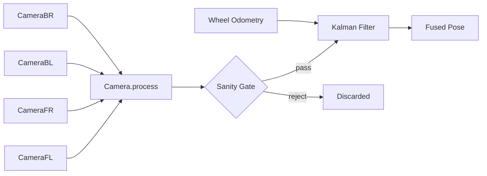

# Vision Pose Estimation — Design Notes

## Approach: Feed All Cameras Into the Kalman Filter

Every camera measurement that passes basic sanity checks is fed into the drivetrain's Kalman filter (WPILib pose estimator) with **continuously scaled standard deviations**. We do _not_ pick a single "best" camera per cycle.

### Data Flow



### Sanity Gate (reject before filtering)

| Check | Threshold | Why |
|-------|-----------|-----|
| Ambiguity | > 0.25 | Detection is too uncertain to be useful |
| Field bounds | x ∉ [0, 16.54] or y ∉ [0, 8.21] | Physically impossible pose |
| Pose jump | > 5 m from current odometry | Likely a misidentified tag |

### Standard Deviation Scaling

Measurements that pass the gate are weighted by quality, not filtered by tier:

```
xyStdDev    = 0.01 + (ambiguity × 2.0) + (distance × 0.05)
thetaStdDev = deg2rad(2 + ambiguity × 50 + distance × 10)
```

A close, low-ambiguity detection gets tight std devs (~0.01 m, ~2°) and strongly pulls the filter. A distant, marginal detection gets wide std devs and barely nudges it.

## Why Not Pick a Single Best Camera?

The previous approach selected only the lowest-ambiguity camera per cycle and threw away the rest. This is tempting because it sounds like "use only the best data," but it has real downsides:

### 1. You throw away valid information

If three cameras see tags with ambiguities 0.03, 0.05, and 0.08, the single-best approach uses only the 0.03 measurement and discards two perfectly good readings. The Kalman filter is specifically designed to fuse multiple noisy measurements — more data points (properly weighted) always produce a better estimate than fewer.

### 2. The "best" camera changes frame-to-frame

When two cameras have similar ambiguity (say 0.04 and 0.05), which one "wins" flips randomly each cycle due to noise. This makes the pose estimator jump between two slightly different viewpoints, introducing jitter that the filter has to smooth out. Feeding both in with appropriate weights lets the filter blend them smoothly.

### 3. Threshold-based tiers create cliff edges

The old code had two tiers (< 0.1 and < 0.2) with different std devs. A measurement at ambiguity 0.099 got tight std devs (2° angle uncertainty). At 0.101 it got loose std devs (10°). At 0.201 it was thrown away entirely. These hard boundaries create discontinuous behavior — a tiny change in ambiguity causes a large jump in how much the measurement is trusted.

Continuous scaling eliminates this: ambiguity 0.099 and 0.101 get nearly identical weights.

### 4. Single-camera selection is fragile to occlusion

If the "best" camera gets momentarily occluded (a game piece passes in front, another robot blocks the view), the system gets zero vision updates that cycle even though three other cameras may have clear views. Multi-camera feeding is inherently robust to partial occlusion.

## Timestamp Correction

We use `result.getTimestampSeconds()` (the actual image capture time from the PhotonVision pipeline) instead of `Timer.getFPGATimestamp()` (the current roboRIO time). The difference matters because:

- Image capture → processing → NetworkTables transfer adds 20–80 ms of latency
- The Kalman filter uses the timestamp to retroactively insert the measurement into its history
- Using the wrong timestamp means the filter fuses the measurement at the wrong odometry state, degrading accuracy proportional to robot speed

## Transform Direction

`PhotonUtils.estimateFieldToRobotAprilTag()` expects a **camera-to-robot** transform (where is the robot origin relative to the camera?). Our constants are defined as **robot-to-camera** (where is each camera relative to robot center?) because that's the intuitive physical description. We call `.inverse()` at the call site:

```java
cameraProcessor.setCameraToRobot(robotToCam.inverse());
```

## Tuning Guide

| Parameter | Current Value | Effect of Increasing |
|-----------|---------------|---------------------|
| `MAX_AMBIGUITY` | 0.25 | Admits noisier detections (more data but lower quality) |
| `MAX_POSE_JUMP` | 5.0 m | Permits larger corrections (helps recovery but risks bad data) |
| `ambiguity × 2.0` coefficient | 2.0 | High-ambiguity measurements trusted less |
| `distance × 0.05` coefficient | 0.05 | Far-away measurements trusted less |
| Base xy std dev | 0.01 m | Minimum position uncertainty even for perfect detections |
| Base theta std dev | 2° | Minimum angle uncertainty even for perfect detections |

Adjust these by reviewing `Vision/BestAmbiguity` and `Vision/MeasurementCount` in AdvantageScope logs. If the pose oscillates, increase the base std devs. If it converges too slowly, decrease them.

## Files

| File | Responsibility |
|------|---------------|
| `Camera.java` | Processes a single camera frame, returns `CameraResult` (pose, distance, ambiguity) |
| `CameraUsing.java` | Orchestrates all 4 cameras, applies sanity gate and std-dev scaling, feeds Kalman filter |
| `CommandSwerveDrivetrain.java` | Hosts the Kalman filter via Phoenix 6 `SwerveDrivetrain.addVisionMeasurement()` |

## AdvantageKit Log Keys

| Key | Type | Description |
|-----|------|-------------|
| `Vision/HasTarget` | boolean | At least one camera contributed this cycle |
| `Vision/MeasurementCount` | int | Number of cameras that passed the sanity gate |
| `Vision/EstimatedPose` | Pose2d | Best (lowest ambiguity) pose estimate this cycle |
| `Vision/BestAmbiguity` | double | Ambiguity of the best measurement this cycle |
